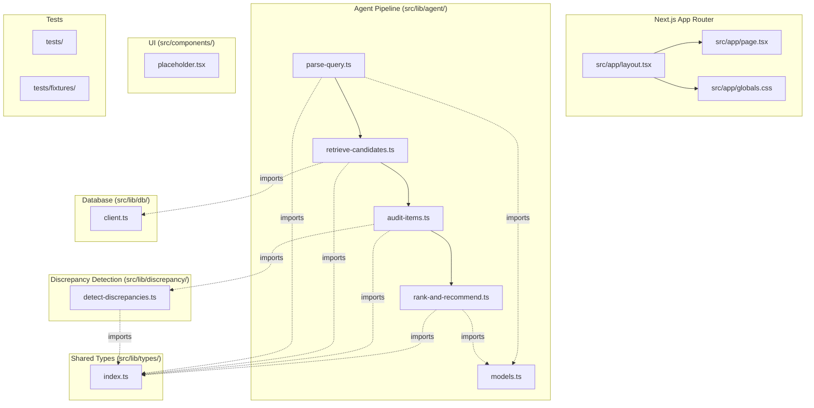
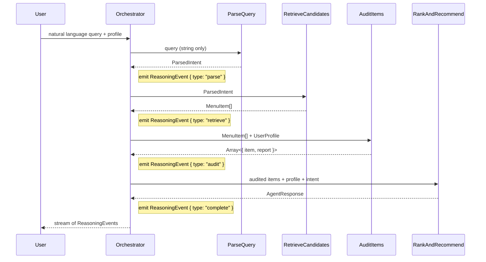

# Design Document: Project Scaffold

## Overview

This design defines the initial scaffolding for the BiteCheck Next.js 15 application. The scaffold establishes the project structure, configuration files, shared TypeScript types, and stub functions so that subsequent specs (Agent Decision Loop, Discrepancy Detection, Streaming UI) can be implemented against a consistent, buildable codebase.

**No business logic is implemented.** Every function body is a TODO placeholder. The value of this scaffold is that it locks down the type contracts, directory conventions, and toolchain configuration before any feature work begins.

### Key Design Decisions

1. **4-step pipeline, not 5.** The `rankAndRecommend` step produces the full `AgentResponse` (recommendations, warnings, reasoning_summary). The pipeline orchestrator wraps this as a `ReasoningEvent { type: "complete" }` for streaming. No separate `generateResponse` step exists — it would add an unnecessary hop with no distinct responsibility.

2. **`parseQuery` takes only `(query: string)`.** The user profile is intentionally excluded from the parse step. Passing the profile here would let the LLM filter at parse time, bypassing the deterministic discrepancy detector that runs in step 3. The profile enters the pipeline at `auditItems` (step 3) and `rankAndRecommend` (step 4).

3. **Types-first approach.** All shared types live in `src/lib/types/` and are imported by every module. This prevents drift between specs and ensures the pipeline steps agree on data shapes before any logic is written.

4. **Model strings centralized with `as const`.** The `MODELS` object in `src/lib/agent/models.ts` uses `as const` so TypeScript infers literal types (`"gpt-4o"`, not `string`). Changing the model requires editing one file.

5. **Supabase client fails fast.** Missing environment variables throw at initialization, not at first query. This surfaces configuration errors during development, not in production at runtime.

## Architecture

The scaffold follows a layered architecture within a Next.js 15 App Router project:



### Data Flow (Pipeline)



## Components and Interfaces

### 1. Shared Types (`src/lib/types/index.ts`)

All types are exported from a single barrel file. Every module in the project imports from `@/lib/types`.

**`UserProfile`** — The student's dietary configuration, loaded from Supabase on session start.

```typescript
export type UserProfile = {
  restrictions: string[];       // e.g., ["vegan", "gluten-free"]
  religious_dietary: string[];  // e.g., ["hindu-vegetarian", "halal"]
  allergens: string[];          // e.g., ["dairy", "tree-nuts"]
  severity: "medical" | "strict" | "preference";
};
```

**`MenuItem`** — A single row from the Cal Poly dining dataset. Field names use snake_case matching the CSV columns.

```typescript
export type MenuItem = {
  item_name: string;
  location: string;
  meal_period: string;
  station: string;
  description: string;
  ingredients: string;
  dietary_labels: string;
  allergens: string;
  calories: number;
  protein_g: number;
  total_fat_g: number;
  total_carbs_g: number;
  fiber_g: number;
  sodium_mg: number;
  sugar_g: number;
  added_sugar_g: number;
  sat_fat_g: number;
  trans_fat_g: number;
  cholesterol_mg: number;
  calcium_mg: number;
  iron_mg: number;
  potassium_mg: number;
  vitamin_c_mg: number;
  vitamin_d_mcg: number;
};
```

**`ConflictType`** — The five categories of data conflicts the discrepancy detector identifies.

```typescript
export type ConflictType =
  | "label_ingredient"
  | "missing_classification"
  | "cross_contamination"
  | "allergen_in_dietary_field"
  | "empty_data";
```

**`DiscrepancyReport`** — Output of the deterministic discrepancy detector (spec 02).

```typescript
export type DiscrepancyReport = {
  status: "safe" | "flagged" | "unsafe" | "insufficient_data";
  conflicts: Array<{
    type: ConflictType;
    description: string;
    fields_involved: string[];
  }>;
};
```

**`ParsedIntent`** — Structured output from the LLM parse step.

```typescript
export type ParsedIntent = {
  location_filter: string | null;
  meal_period_filter: "Breakfast" | "Lunch" | "Dinner" | null;
  nutritional_goal: {
    nutrient: string;
    target: number;
    op: "min" | "max";
  } | null;
  query_type: "what_can_i_eat" | "is_this_safe" | "nutritional_optimization" | "general";
};
```

**`AgentResponse`** — The final structured output from `rankAndRecommend`.

```typescript
export type AgentResponse = {
  recommendations: Array<{
    item_name: string;
    location: string;
    confidence: "high" | "medium" | "low";
    reasoning: string;
    nutrition_summary?: string;
    source_fields: string[];
  }>;
  warnings: Array<{
    item_name: string;
    issue: "label_conflict" | "ambiguous_data" | "cross_contamination_risk" | "missing_data";
    explanation: string;
  }>;
  reasoning_summary: string;
};
```

**`ReasoningEvent`** — Discriminated union for streaming pipeline events to the UI.

```typescript
export type ReasoningEvent =
  | { type: "parse"; message: string; result: ParsedIntent }
  | { type: "retrieve"; message: string; count: number }
  | { type: "audit"; message: string; flagged_examples: Array<{ item_name: string; issue: string }> }
  | { type: "rank"; message: string }
  | { type: "complete"; recommendations: AgentResponse["recommendations"]; warnings: AgentResponse["warnings"]; reasoning_summary: string }
  | { type: "error"; message: string; step: string };
```

### 2. Model Registry (`src/lib/agent/models.ts`)

```typescript
export const MODELS = {
  AGENT_REASONING: "gpt-4o",
  COST_SENSITIVE: "gpt-4o-mini",
} as const;
```

The `as const` assertion ensures TypeScript infers `"gpt-4o"` (literal) rather than `string`. All LLM-calling code imports from this file — no hardcoded model strings elsewhere.

### 3. Pipeline Step Stubs (`src/lib/agent/`)

Each step is a separate file exporting a single async function (except `auditItems` which is synchronous since it calls the deterministic detector). All contain only a TODO comment and a placeholder throw/return.

| File | Function | Signature | Returns |
|------|----------|-----------|---------|
| `parse-query.ts` | `parseQuery` | `(query: string)` | `Promise<ParsedIntent>` |
| `retrieve-candidates.ts` | `retrieveCandidates` | `(intent: ParsedIntent)` | `Promise<MenuItem[]>` |
| `audit-items.ts` | `auditItems` | `(items: MenuItem[], profile: UserProfile)` | `Array<{ item: MenuItem; report: DiscrepancyReport }>` |
| `rank-and-recommend.ts` | `rankAndRecommend` | `(auditedItems: Array<{ item: MenuItem; report: DiscrepancyReport }>, profile: UserProfile, intent: ParsedIntent)` | `Promise<AgentResponse>` |

**Design rationale for `parseQuery(query: string)` — no profile parameter:**
The parse step extracts structural intent (location, meal period, query type) from the raw query string. The user profile is deliberately excluded to prevent the LLM from filtering or biasing results at parse time. Filtering happens deterministically in `auditItems` (step 3) via the discrepancy detector, ensuring all safety logic is auditable and reproducible. If the profile were available at parse time, the LLM could silently exclude items, bypassing the detector entirely.

**Design rationale for no `generate-response.ts`:**
The `rankAndRecommend` step already produces the complete `AgentResponse` structure (recommendations, warnings, reasoning_summary). The pipeline orchestrator wraps this output as `ReasoningEvent { type: "complete" }` for streaming to the UI. A separate generation step would duplicate responsibility with no added value.

### 4. Discrepancy Detector Stub (`src/lib/discrepancy/detect-discrepancies.ts`)

```typescript
export function detectDiscrepancies(
  item: MenuItem,
  profile: UserProfile
): DiscrepancyReport {
  // TODO: implement per spec 02
}
```

This is a **pure, synchronous function** — no LLM call, no database access. It runs deterministically so results are reproducible. The `auditItems` pipeline step calls this function for each candidate item.

### 5. Supabase Client (`src/lib/db/client.ts`)

Two exports:

- **`supabase`** — Public client initialized with `NEXT_PUBLIC_SUPABASE_URL` and `NEXT_PUBLIC_SUPABASE_ANON_KEY`. Used for client-side and standard server-side queries.
- **`supabaseAdmin`** — Admin client initialized with `NEXT_PUBLIC_SUPABASE_URL` and `SUPABASE_SERVICE_ROLE_KEY`. Used for server-side operations requiring elevated privileges.

Both clients throw a descriptive error at initialization if their required environment variables are missing. This fails fast during development rather than producing cryptic errors at query time.

```typescript
import { createClient } from "@supabase/supabase-js";

const supabaseUrl = process.env.NEXT_PUBLIC_SUPABASE_URL;
const supabaseAnonKey = process.env.NEXT_PUBLIC_SUPABASE_ANON_KEY;
const supabaseServiceRoleKey = process.env.SUPABASE_SERVICE_ROLE_KEY;

if (!supabaseUrl || !supabaseAnonKey) {
  throw new Error(
    "Missing Supabase environment variables: NEXT_PUBLIC_SUPABASE_URL and NEXT_PUBLIC_SUPABASE_ANON_KEY must be set"
  );
}

export const supabase = createClient(supabaseUrl, supabaseAnonKey);

if (!supabaseServiceRoleKey) {
  throw new Error(
    "Missing Supabase environment variable: SUPABASE_SERVICE_ROLE_KEY must be set"
  );
}

export const supabaseAdmin = createClient(supabaseUrl, supabaseServiceRoleKey);
```

### 6. App Router Entry Point (`src/app/`)

Minimal files to confirm the framework is wired:

- **`layout.tsx`** — Root layout with `<html>` and `<body>` tags, imports `globals.css`.
- **`page.tsx`** — Home page rendering `<h1>BiteCheck</h1>` as a placeholder.
- **`globals.css`** — Tailwind directives (`@tailwind base; @tailwind components; @tailwind utilities;`).

### 7. Component Placeholder (`src/components/placeholder.tsx`)

A minimal React component exporting a `<div>` with a comment indicating future UI work. This ensures the `src/components/` directory exists and is importable.

## Data Models

### Supabase `menu_items` Table

The scaffold does not create or migrate the database table — that's managed in Supabase directly. The `MenuItem` type mirrors the table schema:

| Column | TypeScript Type | Notes |
|--------|----------------|-------|
| `item_name` | `string` | Menu item display name |
| `location` | `string` | Dining hall name (e.g., "19 Metro") |
| `meal_period` | `string` | "Breakfast", "Lunch", or "Dinner" |
| `station` | `string` | Station within the dining hall |
| `description` | `string` | Free-text description |
| `ingredients` | `string` | Free-text ingredients list |
| `dietary_labels` | `string` | Semicolon-delimited mixed field (see spec 02) |
| `allergens` | `string` | Empty across current dataset |
| `calories` | `number` | kcal |
| `protein_g` through `vitamin_d_mcg` | `number` | Nutrition columns |

### User Profile Storage

User profiles are stored in Supabase (table TBD in a future spec). The `UserProfile` type defines the shape:

- `restrictions` — canonical strings from the domain vocabulary (e.g., `"vegan"`, `"gluten-free"`)
- `religious_dietary` — canonical strings (e.g., `"hindu-vegetarian"`, `"halal"`)
- `allergens` — canonical strings (e.g., `"dairy"`, `"tree-nuts"`)
- `severity` — one of `"medical"`, `"strict"`, `"preference"`

### Configuration Files

| File | Purpose |
|------|---------|
| `package.json` | Dependencies: next@15, react, react-dom, typescript, tailwindcss, openai@4+, @supabase/supabase-js, zod. Dev: vitest |
| `tsconfig.json` | Strict mode, `@/*` → `src/*` path alias, JSX preserve |
| `tailwind.config.ts` | Content scan: `src/**/*.{ts,tsx}` |
| `next.config.mjs` | App Router defaults, no custom overrides |
| `vitest.config.ts` | Path alias resolution matching tsconfig |
| `.gitignore` | Excludes `.env.local`, `.env`, `node_modules/`, `.next/`, `.DS_Store`. Does NOT exclude `.kiro/` |

## Directory Structure

```
├── .env.local                          # Environment variables (git-ignored)
├── .gitignore
├── .kiro/                              # Specs and steering (version-controlled)
├── next.config.mjs
├── package.json
├── tailwind.config.ts
├── tsconfig.json
├── vitest.config.ts
├── src/
│   ├── app/
│   │   ├── globals.css                 # Tailwind directives
│   │   ├── layout.tsx                  # Root layout
│   │   └── page.tsx                    # Home page placeholder
│   ├── components/
│   │   └── placeholder.tsx             # Future UI work
│   ├── lib/
│   │   ├── agent/
│   │   │   ├── models.ts              # MODELS registry (as const)
│   │   │   ├── parse-query.ts         # Step 1 stub
│   │   │   ├── retrieve-candidates.ts # Step 2 stub
│   │   │   ├── audit-items.ts         # Step 3 stub
│   │   │   └── rank-and-recommend.ts  # Step 4 stub
│   │   ├── db/
│   │   │   └── client.ts             # Supabase public + admin clients
│   │   ├── discrepancy/
│   │   │   └── detect-discrepancies.ts # Detector stub
│   │   └── types/
│   │       └── index.ts               # All shared types
│   └── ...
├── tests/
│   └── fixtures/                       # Test fixture data
└── ...
```

## Error Handling

Since this is a scaffold with no business logic, error handling is limited to:

1. **Supabase client initialization** — Throws descriptive errors when environment variables are missing. This is the only runtime error path in the scaffold.

2. **Stub functions** — Each stub throws `new Error("Not implemented")` or returns a type-safe placeholder. This ensures that accidentally calling a stub during development produces a clear error rather than silent undefined behavior.

3. **Build-time errors** — TypeScript strict mode catches type mismatches at build time. The `npm run build` command must pass with zero errors as an acceptance criterion.

Future specs will implement the error handling patterns defined in the steering documents (8-second LLM timeouts, graceful degradation, `ReasoningEvent { type: "error" }` emission).

## Testing Strategy

### Why Property-Based Testing Does Not Apply

This scaffold contains no business logic, no pure functions with meaningful input/output behavior, and no data transformations. The acceptance criteria are structural:

- "File X exists at path Y"
- "File X exports type Z"
- "Configuration file has property P"
- "Build completes without errors"

These are **configuration and setup checks** — they pass or fail deterministically with no input variation. Running 100 iterations of "does `tsconfig.json` have strict mode enabled" finds exactly as many bugs as running it once. Property-based testing adds no value here.

### Testing Approach

**Example-based unit tests with Vitest**, organized by concern:

1. **Type export tests** — Verify that all shared types are importable from `@/lib/types` and have the expected shape. Use TypeScript's type system (compile-time checks) supplemented by runtime assertions on type guards where useful.

2. **Stub signature tests** — Verify each pipeline step is importable and has the correct function signature. Call each stub and confirm it throws `"Not implemented"` (or returns the expected placeholder).

3. **Model registry tests** — Verify `MODELS.AGENT_REASONING === "gpt-4o"` and `MODELS.COST_SENSITIVE === "gpt-4o-mini"`. Verify the object is frozen/const (literal types).

4. **Supabase client tests** — Verify that missing environment variables produce descriptive errors. Mock `process.env` to test both the happy path (client created) and error path (missing vars).

5. **Build verification** — `npm run build` completes with exit code 0. This is the most important test — it proves all types are consistent and all imports resolve.

6. **Git configuration test** — Verify `.gitignore` contains required entries and does not exclude `.kiro/`.

### Test File Organization

```
tests/
├── types.test.ts              # Type exports and shape verification
├── stubs.test.ts              # Pipeline step stub signatures
├── models.test.ts             # Model registry values
├── db-client.test.ts          # Supabase client initialization
├── build.test.ts              # Build verification (or run as CI step)
└── fixtures/                  # Fixture data for future specs
```

### Test Runner Configuration

- **Vitest** with path alias resolution matching `tsconfig.json`
- No watch mode in CI — use `vitest --run`
- Path aliases: `@/*` → `src/*`
